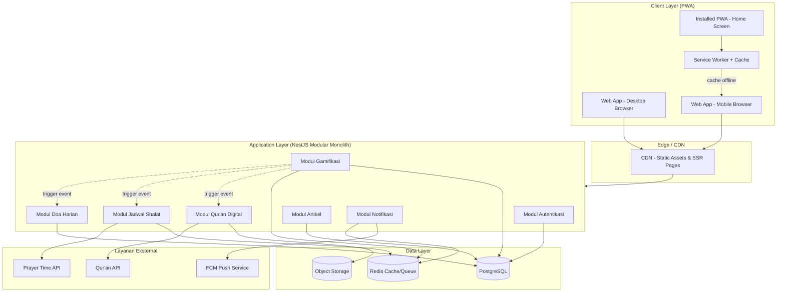
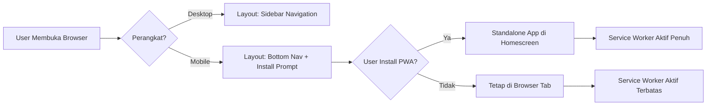
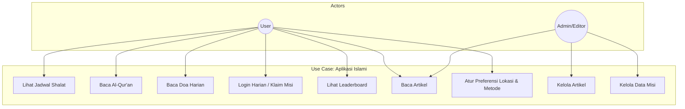
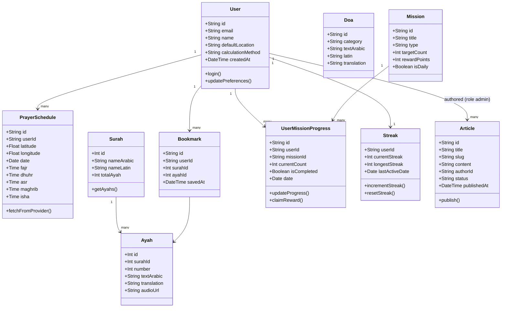
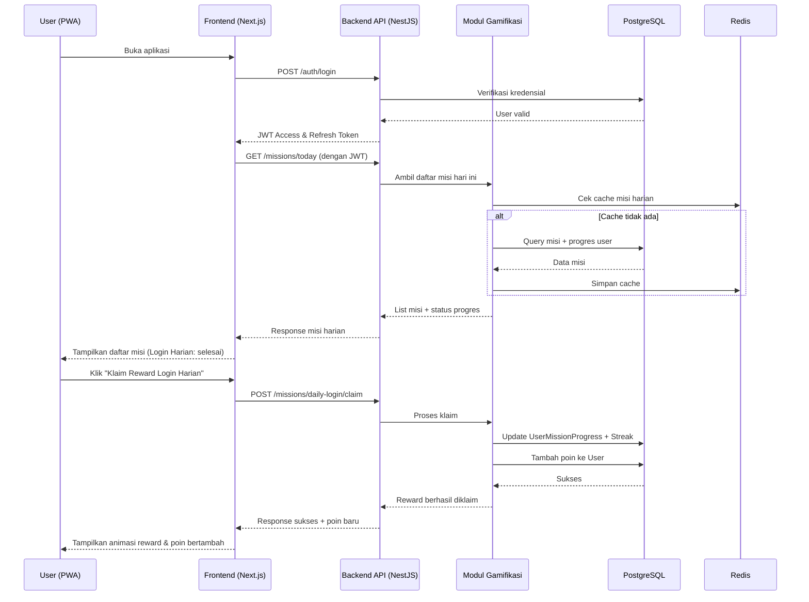
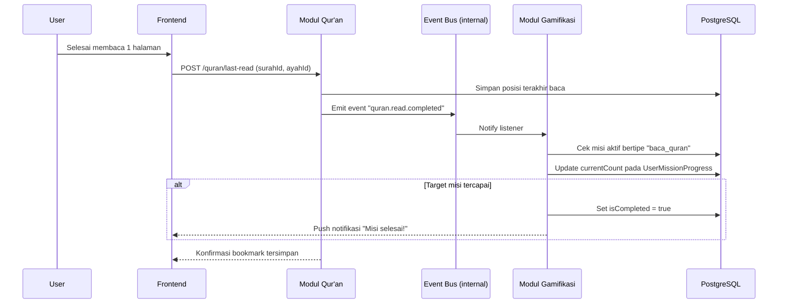
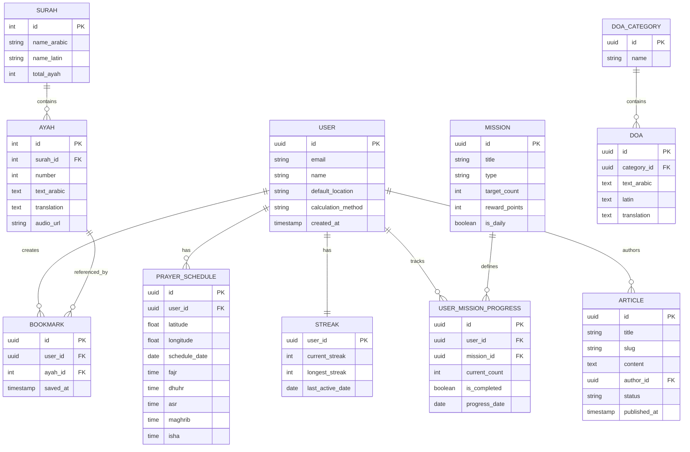
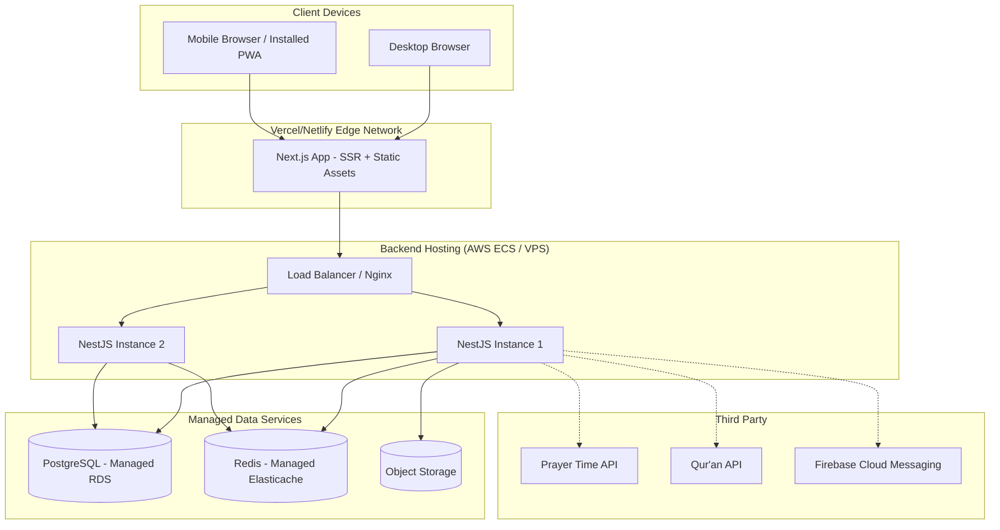

# Blueprint Arsitektur Enterprise
## Aplikasi Web Islami (Jadwal Shalat, Qur'an, Doa, Gamifikasi Ibadah, Artikel Keislaman)

**Versi:** 1.0
**Tipe Platform:** Progressive Web App (PWA) — Desktop & Mobile
**Disusun sebagai:** Blueprint Arsitektur Enterprise

---

## 1. Ringkasan Eksekutif

Aplikasi ini dirancang sebagai satu platform web terpadu yang dapat diakses dari desktop maupun perangkat mobile tanpa perlu membangun aplikasi native terpisah untuk Android/iOS. Pendekatan yang digunakan adalah **Progressive Web App (PWA)** di atas arsitektur **client-server berlapis (layered architecture)** dengan pemisahan tegas antara presentation layer, application/business logic layer, dan data layer, agar sistem mudah diskalakan dan dipelihara jangka panjang.

Lima domain fungsional utama — jadwal shalat, Al-Qur'an digital, doa harian, gamifikasi ibadah, dan artikel keislaman — didekati sebagai **modul-modul yang loosely coupled**, masing-masing dengan tanggung jawab data dan logika bisnisnya sendiri, namun berbagi fondasi autentikasi dan infrastruktur yang sama.

---

## 2. Prinsip Arsitektur

Beberapa prinsip yang menjadi acuan dalam menyusun blueprint ini:

Pemisahan tanggung jawab per modul dijaga ketat (separation of concerns), sehingga modul gamifikasi misalnya tidak perlu tahu detail internal bagaimana data Qur'an disimpan — ia hanya berkomunikasi lewat event/API kontrak yang jelas. Desain juga mengutamakan **offline-first** untuk fitur-fitur inti (jadwal shalat, doa, bacaan terakhir Qur'an), mengingat pengguna mobile sering berada di kondisi jaringan tidak stabil. Sistem dibangun **API-first**, artinya backend menyediakan REST/GraphQL API yang sama baik dikonsumsi oleh web app maupun kelak aplikasi native jika dibutuhkan. Terakhir, skalabilitas horizontal menjadi pertimbangan sejak awal, khususnya untuk modul gamifikasi yang berpotensi memiliki trafik tulis (write) tinggi saat jam-jam ibadah tertentu (misalnya menjelang Maghrib).

---

## 3. Tech Stack

### 3.1 Frontend (Client Layer)

| Komponen | Teknologi | Alasan |
|---|---|---|
| Framework | **Next.js (React)** | Mendukung SSR/SSG untuk SEO artikel, mudah dikonversi ke PWA |
| Styling | **Tailwind CSS** | Konsisten, cepat untuk desain responsif desktop-mobile |
| State Management | **Zustand / React Query (TanStack Query)** | React Query untuk data server (caching, sinkronisasi), Zustand untuk state lokal ringan |
| PWA Layer | **Workbox (Service Worker)** | Standar industri untuk caching strategy & offline support |
| Audio Player (Murottal) | **Howler.js** | Kontrol audio lintas browser yang stabil |

### 3.2 Backend (Application Layer)

| Komponen | Teknologi | Alasan |
|---|---|---|
| Runtime | **Node.js** | Konsisten bahasa (JS/TS) dengan frontend, ekosistem luas |
| Framework API | **NestJS** | Struktur modular (module-controller-service) native, cocok untuk arsitektur multi-modul enterprise |
| Autentikasi | **JWT + OAuth2 (Google/Apple Sign-In)** | Standar untuk web modern, mendukung refresh token untuk sesi mobile |
| Validasi Data | **class-validator / Zod** | Validasi request terstruktur |
| Job Scheduler | **BullMQ (Redis-based)** | Untuk reset misi harian, kirim notifikasi terjadwal |

### 3.3 Data Layer

| Komponen | Teknologi | Alasan |
|---|---|---|
| Database Utama | **PostgreSQL** | Relasional, cocok untuk data user, progres misi, dan artikel yang terstruktur kuat |
| Cache / Session | **Redis** | Cache jadwal shalat per lokasi, leaderboard real-time, session |
| Object Storage | **S3-compatible (AWS S3 / Cloudflare R2)** | Menyimpan audio murottal, gambar artikel, badge |
| Search Engine (opsional) | **Meilisearch / PostgreSQL Full-Text Search** | Pencarian ayat Qur'an & artikel yang cepat |

### 3.4 Infrastruktur & DevOps

| Komponen | Teknologi |
|---|---|
| Containerization | Docker |
| Orkestrasi (jika skala besar) | Kubernetes / Docker Compose (untuk skala menengah) |
| CI/CD | GitHub Actions |
| Hosting Frontend | Vercel / Netlify |
| Hosting Backend | Railway / AWS ECS / VPS + Nginx reverse proxy |
| Monitoring | Sentry (error tracking), Grafana + Prometheus (metrics) |
| Notifikasi Push | Firebase Cloud Messaging (FCM) — kompatibel Web Push |

### 3.5 API Eksternal (Third-Party)

| Kebutuhan | Sumber |
|---|---|
| Waktu Shalat | Aladhan API / sumber perhitungan falak lain |
| Teks & Audio Qur'an | Al-Qur'an Cloud API / EQuran.id API |
| Geolocation | Browser Geolocation API + fallback IP-based geolocation |

---

## 4. Arsitektur Sistem — High Level

**Catatan arsitektur:** Backend didesain sebagai **modular monolith** (bukan microservices) di tahap awal, karena skala aplikasi belum membutuhkan kompleksitas microservices. Setiap modul di NestJS tetap terisolasi secara kode (folder per modul, boundary jelas) sehingga jika suatu saat perlu dipecah menjadi microservice independen (misalnya modul Gamifikasi karena bebannya tinggi), migrasinya tidak butuh rewrite total.

---

## 5. Rincian per Modul

### 5.1 Modul Autentikasi & Profil Pengguna
Mengelola registrasi, login (email/password + OAuth Google), refresh token, dan penyimpanan preferensi (lokasi default, metode perhitungan shalat, bahasa terjemahan). Endpoint utama: `POST /auth/register`, `POST /auth/login`, `POST /auth/refresh`, `GET /users/me`, `PATCH /users/me/preferences`.

### 5.2 Modul Jadwal Shalat
Mengambil koordinat user (GPS atau input manual), memanggil API perhitungan falak eksternal, menyimpan hasil di Redis dengan TTL harian per kombinasi lokasi+metode agar tidak memanggil API eksternal berulang. Endpoint utama: `GET /prayer-times?lat=&lng=&method=`, `GET /prayer-times/today`.

### 5.3 Modul Al-Qur'an Digital
Menyediakan teks Arab, terjemahan, dan audio murottal per surah/ayat, serta menyimpan bookmark dan posisi terakhir baca per user. Endpoint utama: `GET /quran/surah/:id`, `GET /quran/ayah/:id`, `POST /quran/bookmark`, `GET /quran/last-read`.

### 5.4 Modul Doa Harian
Data doa tersimpan statis terstruktur per kategori, dengan endpoint pencarian dan bookmark. Endpoint utama: `GET /doa/categories`, `GET /doa/:categoryId`, `POST /doa/favorite`.

### 5.5 Modul Gamifikasi Ibadah
Modul paling kompleks — bertanggung jawab atas pencatatan aktivitas harian, perhitungan streak, poin, badge, dan misi. Modul ini bersifat **event-driven**: modul lain (Qur'an, Doa, Shalat) mengirim event (misalnya `quran.read.completed`) yang didengarkan oleh modul ini untuk memperbarui progres misi. Endpoint utama: `GET /missions/today`, `POST /missions/:id/claim`, `GET /users/me/streak`, `GET /leaderboard`.

### 5.6 Modul Artikel Keislaman
CMS ringan dengan dashboard admin terpisah (role-based access). Endpoint utama: `GET /articles`, `GET /articles/:slug`, `POST /admin/articles` (khusus role editor/admin), `PATCH /admin/articles/:id`.

### 5.7 Modul Notifikasi
Mengelola pengiriman Web Push (via FCM) untuk pengingat waktu shalat dan misi belum selesai, dijadwalkan lewat BullMQ berdasarkan jadwal shalat harian masing-masing user.

---

## 6. Arsitektur PWA (Mobile & Desktop)

Agar satu codebase web dapat berfungsi optimal di desktop maupun mobile sebagai aplikasi yang "terasa native", tiga komponen PWA berikut wajib ada:

**Web App Manifest** (`manifest.json`) — mendefinisikan nama aplikasi, ikon di berbagai resolusi, warna tema, dan `display: standalone` agar saat diinstall di homescreen, aplikasi tampil tanpa address bar browser.

**Service Worker** — menggunakan strategi caching berlapis: *Cache First* untuk aset statis (font, ikon, teks doa yang jarang berubah), *Network First with fallback to cache* untuk jadwal shalat dan artikel (data yang perlu update tapi tetap harus bisa diakses offline), dan *Stale-While-Revalidate* untuk teks Qur'an (langsung tampil dari cache sambil diperbarui di background).

**Responsive Layout System** — menggunakan pendekatan mobile-first dengan breakpoint Tailwind, memastikan komponen seperti navigasi berubah dari sidebar (desktop) menjadi bottom navigation bar (mobile), pola umum pada aplikasi PWA yang menargetkan kedua form factor.

---

## 7. Diagram UML

### 7.1 Use Case Diagram

### 7.2 Class Diagram (Domain Model)

### 7.3 Sequence Diagram — Login & Klaim Misi Harian

### 7.4 Sequence Diagram — Baca Qur'an Memicu Progres Misi (Event-Driven)

### 7.5 Entity Relationship Diagram (ERD)

### 7.6 Deployment Diagram

---

## 8. Pertimbangan Keamanan

Beberapa aspek keamanan yang perlu masuk dalam implementasi: **rate limiting** pada endpoint publik (khususnya jadwal shalat dan Qur'an) untuk mencegah abuse terhadap API eksternal yang biasanya punya kuota; **hashing password** dengan bcrypt/argon2; **role-based access control (RBAC)** untuk membedakan user biasa dan admin/editor artikel; serta **validasi input ketat** di setiap endpoint untuk mencegah injection, khususnya pada modul artikel yang menerima konten HTML/rich text (perlu sanitasi seperti DOMPurify).

---

## 9. Roadmap Implementasi (Bertahap)

**Fase 1 — Fondasi:** Modul Autentikasi, arsitektur PWA dasar (manifest + service worker), dan Modul Jadwal Shalat (fitur paling sering dipakai harian, cocok jadi MVP).

**Fase 2 — Konten Ibadah:** Modul Qur'an Digital dan Modul Doa Harian, termasuk fitur bookmark dan mode offline.

**Fase 3 — Engagement:** Modul Gamifikasi (misi, streak, poin, leaderboard) beserta sistem event-driven yang menghubungkan ke modul-modul sebelumnya.

**Fase 4 — Konten & Penyempurnaan:** Modul Artikel Keislaman lengkap dengan dashboard admin, sistem notifikasi push, dan optimasi performa (caching, SSR tuning).

---

*Dokumen ini adalah blueprint arsitektur tingkat tinggi. Detail implementasi teknis per endpoint (request/response schema, error handling, dan skema database lengkap dengan index/constraint) dapat disusun sebagai dokumen turunan (Technical Design Document) pada tahap berikutnya.*
